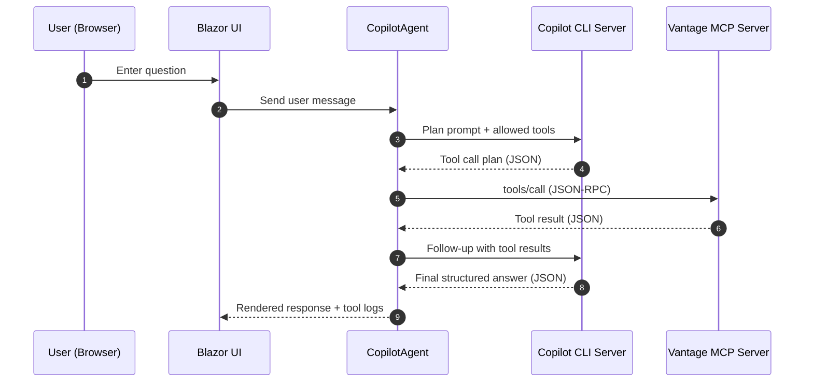
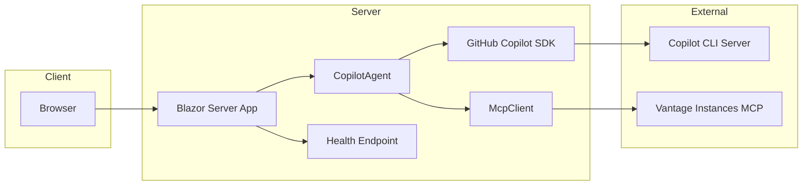

# CloudCopilot

Blazor Server chatbot that uses the GitHub Copilot SDK (CLI server mode) and the Vantage Instances MCP server to answer cloud instance pricing questions with tool-backed facts.


## Prerequisites

- .NET SDK 10.0
- GitHub Copilot CLI installed and authenticated
- Access to a Vantage Instances MCP server

### Install Copilot CLI

Follow GitHub's Copilot CLI install guide for your OS:
- https://docs.github.com/copilot

After install, authenticate (command depends on your CLI install):
```
# Example
copilot auth login
# or
gh copilot auth login
```

### Configuration

Set the MCP server URL and optional API key via environment variables (recommended):
```
export VANTAGE_INSTANCES_MCP_URL="https://your-mcp-server"
export VANTAGE_INSTANCES_MCP_KEY="your-api-key"   # optional
```

You can also place these in configuration (appsettings.json / appsettings.Development.json):
```
{
  "Vantage": {
    "InstancesMcpUrl": "https://your-mcp-server",
    "InstancesMcpKey": "your-api-key"
  }
}
```

## Run

From the repo root:
```
cd src

dotnet restore

dotnet run
```

Navigate to the app URL shown in the console. The `/health` endpoint returns MCP + Copilot connectivity status.

## System Overview

The app configures the Copilot SDK to use Copilot CLI server mode. The agent can only call Vantage Instances MCP tools and never uses filesystem, git, or web tools.

### Flow Diagram



### Architecture Diagram



## Key Components

- `src/Services/CopilotAgent.cs`
  - Builds the system prompt with allowed tool list and response schema.
  - Orchestrates tool calls through MCP based on Copilot output.
  - Logs prompts, tool calls, and tool responses.

- `src/Services/McpClient.cs`
  - JSON-RPC client with SSE-aware parsing.
  - Logs raw MCP responses for troubleshooting.

- `src/Components/Pages/Home.razor`
  - Chat UI, tool call panel, and raw MCP results panel.
  - Renders structured responses (message + table + comparable options).

## Tool Access Policy

Only the following MCP tools are exposed to the agent:
- `list_providers`
- `list_families(provider)`
- `search_instances(provider, region?, vcpus?, memoryGiB?, gpu?, family?, priceMax?, purchaseOption?, os?)`
- `get_pricing(provider, instanceType, region, purchaseOption, os)`
- `compare_instances(provider, list, region, purchaseOption, os)`

## Notes

- The agent never invents prices or specs; all facts must come from MCP tool calls.
- If a pricing request omits the region, the agent asks exactly one clarifying question.
- Default `purchaseOption` is `on-demand` and default `os` is `linux` when not specified.

